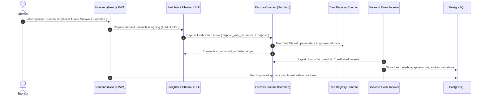
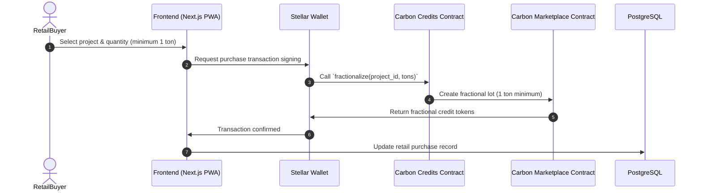
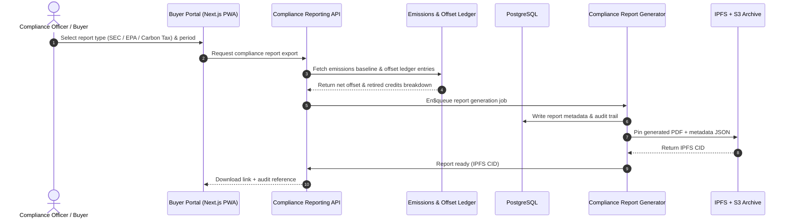
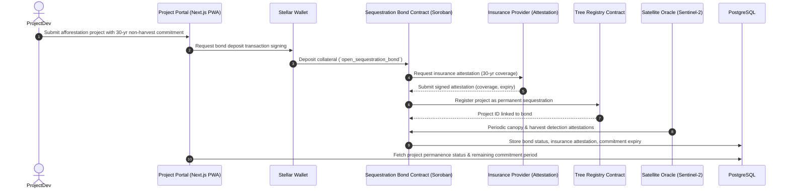

# 🏛 Architecture Documentation — FarmCredit / Harvesta

> **High-Level System Architecture, C4 Architecture Models, Component Specifications, and Data Flows**  
> **Stellar Network (Soroban) • Next.js 15 PWA • Zero-Knowledge Cryptography • PostgreSQL • IPFS • AWS Cloud**  
> **Detailed C4 Specification:** [docs/C4_ARCHITECTURM.md](file:///docs/C4_ARCHITECTURE.md) • **System Architecture Guide:** [docs/ARCHITECTURE.md](file:///docs/ARCHITECTURE.md)

---

## 1. High-Level System Architecture (C4 Context & Container)

```mermaid
flowchart TB
    subgraph Clients["📱 Client Layer (Frontend / PWA)"]
        direction TB
        SP["🌍 Sponsor Web App<br/>(Donations, Carbon Dashboard, DEX)"]
        PL["📸 Planter Mobile PWA<br/>(Offline Camera, GPS Telemetry)"]
        INV["🛰 Investor & Verifier Portal<br/>(Telemetry, Satellite NDVI Map)"]
        GOV["◿️ DAO Governance Portal<br/>(Proposal & Species Voting)"]
        WAL["🔑 stellar Wallets<br/>(Freighter / Albedo / xBull)"]
        ZKW["🔒 ZK WASM Prover<br/>(In-Browser Groth16 Proofs)"]
        
        SP --- WAL
        PL --- WAL
        INV --- WAL
        GOV --- WAL
        SP --- ZKW
        PL --- ZKW
    end

    subgraph Storage["📦 Decentralized Storage (IPFS)"]
        IPFS["🌐 IPFS Network (Pinata Pinning Cluster)<br/>• Planting Photos & Time-lapses<br/>• GPS Telemetry & Metadata JSON<br/>• Dynamic NFT Certificates & Seals"]
    end

    subgraph Backend["⛙️ Backend & Off-Chain Infrastructure"]
        API["🚀 API Server (Next.js 15 App Router / Node.js)<br/>• SEP-10 & JWT Authentication<br/>• Upload Coordinator & EXIF Validator<br/>• Anonymous ZK Relay & Metadata Sanitization<br/>• Compliance Reporting API (SEC / EPA / Carbon Tax)"]
        INDEXER["📡 Stellar Event Indexer & Ingestion<br/>• Soroban RPC Listener<br/>• Horizon Event Streamer<br/>• Event Integrity Checker"]
        CALC["📊 Carbon Sequestration Engine<br/>• FAO/IPCC Biomass Growth Models<br/>• Scheduled Carbon Accrual Crons<br/>• Emissions & Offset Ledger"]
        ORACLE["🛰 Verification & Satellite Engine<br/>• Sentinel-2 Imagery Sync (NDVI Indices)<br/>• GPS Boundary & Geofence Validator<br/>• ZK-Proof Verification Service"]
        WORKERS["⊡ Background Workers & Daemons<br/>• Soroban TTL Renewal Bot<br/>• S3 Multi-Region Backup Replication<br/>• Compliance Report Generator"]
        DB[(🗄️ PostgreSQL Database (AWS RDS)<br/>• Off-chain Cache & Tree Index<br/>• User Profiles, Roles & Audit Trails<br/>• Compliance Reports & Emissions Baselines)]
        REDIS[(⚙️ Redis Cache (AWS ElastiCache)<br/>• Session Tokens & Rate Limits<br/>• BullMQ Task Qeueues)]
        
        API <--> DB 
        API <--> REDIS
        INDEXER --> DB
        CALC <--> DB
        ORACLE <--> DB 
        WORKERS <--> REDIS
        WORKERS --> DB
    end

    subgraph Blockchain["⚡ Stellar Network (Soroban Smart Contracts)"]
        direction TB
        RPC["🔗 Soroban RPC Node / Horizon"]
        
        subgraph Contracts["Smart Contracts Ecosystem (Rust / WASM)"]
            ESC["🔒 Escrow & Settlement<br/>(escrow, tree-escrow, escrow-milestone, donation-escrow, naira-payout)"]
            REG["🌳 Tree & Planter Registries<br/>(tree-registry, tree-token, tree-genetics, planter-registry, planting-bond, sequestration-bond)"]
            CARB["📉 Carbon Credits & DEX<br/>• Carbon Credits & DEX<br/>(carbon-credits, carbon-marketplace, carbon-dex, carbon-price-oracle, soil-health)"]
            ZKC["🛡 Privacy & Zero-Knowledge<br/>(zk-verifier, zk-location-verifier, nullifier-registry, aggregate-verifier)"]
            GOVC["🏛 Governance & Security<br/>(platform-governance, species-voting, treasury, upgrade-timelock, admin-controls)"]
        end
        
        RPC <--> Contracts
    end

    %% Interactions
    PL -->||"1. Upload Proof (Photo + GPS)"| IPFS
    PL -->||2. Submit Job Completion (IPFS CID)"| API
    SP -->||3. Sponsor Tree / Anonymous ZK Deposit"| WAL
    WAL -->||4. Sign & Submit Tx"| RPC
    
    API -->||5. Pin Metadata / Verify CIDs"| IPFS
    API -->||6. Trigger Verification Checks"| ORACLE
    
    INDEXER <-->||7. Poll / Listen to Ledger Events"| RPC
    ORACLE -->||8. Execute Verified Tranche Release"| RPC
    CALC -->||9. Trigger On-Chain Carbon Minting"| RPC
    WORKERS -->||10. Contract TTL Renewal Pings"| RPC
    
    Clients <-->||11. Query Cached Data & Analytics"| API
```

---

## 2. End-to-End Data Flows

### Flow A: Tree Sponsorship, Escrow Lock & Optional Survival Guarantee


---

### Flow B: Planter Work Submission, Satellite Telemetry & Multi-Tranche Release
```mermaid
sequenceDiagram
    autonumber
    actor Planter
    participant PWA as Planter PWA (Offline/Mobile)
    participant IPFS as IPFS (Pinata)
    participant Backend as Backend Verification Service
    participant Oracle as Satellite Oracle (Sentinel-2)
    participant Escrow as Tree Escrow Contract (Soroban)
    participant PlanterReg as Planter Registry
    participant DH as PostgreSQL

    Planter->>PWA: Capture photo & GPS coordinates (offline queue in IndexedDB)
    PWA->>IPFS: Upload photo blob and signed telemetry JSON
    IPFS-->>PWA: Return IPFS CID (`ipfs://Qm...`)
    PWA->>Backend: Submit planting proof with CID & Tree ID
    Backend->>Oracle: Request Sentinel-2 NDVI canopy index check
    Oracle-->>Backend: Canopy vegetation confirmed (NDVI >= 0.7)
    Backend->>Escrow: Trigger milestone verification (`verify_planting_milestone`)
    Escrow->>PlanterReg: Check planter standing & security bond
    Escrow->>Note over Escrow,Planter: Tranche 2 (40%) released at 6mo survival check<br/>Tranche 3 (30%) released at 1yr survival check
    Backend->>DB: Update tree status to `PLANTED / VERIFIED`
```

---

### Flow C: ZK Anonymous Donation & Double-Spend Nullifier Registry
```mermaid
sequenceDiagram
    autonumber
    actor Donor
    participant ZkProver as ZK Prover (SnarkJS / WASM)
    participant Wallet as Stellar Wallet
    participant Escrow as Donation Escrow Contract
    participant ZkVerifier as ZK Verifier Contract (Groth16)
    participant NullifierContract as Nullifier Registry (Soroban)

    Donor->>ZkProver: Input secret, salt & donation amount
    ZkProver->>ZkProver: Generate Groth16 ZK proof + Nullifier hash
    Donor->>Wallet: Sign anonymous donation transaction
    Wallet->>Escrow: Submit `deposit_anonymous(proof, commitment, nullifier)`
    Escrow->>ZkVerifier: Verify Groth16 cryptographic proof
    ZkVerifier-->>Escrow: Proof valid
    Escrow->>NullifierContract: Check & store nullifier commitment
    NullifierContract-->>Escrow: Commitment recorded (asserts not duplicate)
    Escrow-->:Wallet: Anonymous donation confirmed on-chain
```

---

### Flow D: Carbon Credit Fractionalization & Retail Purchase


---

### Flow E: Buyer Compliance Reporting (SEC / EPA / Carbon Tax)


---

### Flow F: Afforestation Permanent Sequestration (30-Year Non-Harvest Ensurance / Bond)


---

## 3. Component Specifications

### 3.1 Frontend (Next.js 15 PWA)

- **Sponsor Web App**: Donation flows, carbon dashboard, DEX.
  - Supports afforestation projects with 30-year non-harvest commitment display.
  - Shows bond / insurance status and remaining commitment period.
- **Planter Mobile PWA**: Offline camera, GPS telemetry, submit planting proofs.
- **Investor & Verifier Portal**: Telemetry, satellite NDVI map, compliance exports.
- **DAO Governance Portal**: Proposal & species voting.
- **stellar Wallets**: Freighter / Albedo / xBull connection.
- Permanence bond / insurance attestation UI for afforestation projects.

### 3.2 Backend & Off-Chain Infrastructure

- **API Server**: Next.js 15 App Router / Node.js.
  - SEP-10 & JWT authentication.
  - Upload coordinator & EXIF validator.
  - Anonymous ZK relay & metadata sanitization.
  - Compliance reporting API (SEC / EPA / Carbon Tax).
  - Afforestation permanence bond / insurance validation endpoints.
- `Stellar Event Indexer & Ingestion`:
  - Soroban RPC listener.
  - Horizon event streamers.
  - Event integrity checker.
  - Ingests `SequestrationBondOpened`, `SequestrationBondReleased`, `HarvestDetected` events.
- **Carbon Sequestration Engine**:
  - FAO/IPCC biomass growth models.
  - Scheduled carbon accrual crons.
  - Emissions & offset ledger.
  - Enforces 30-year non-harvest for afforestation credits (leakage prevention).
- **Verification & Satellite Engine*:
  - Sentinel-2 imagery sync (NDVI indices).
  - GPS boundary & geofence validator.
  - ZK-proof verification service.
  - Harvest detection attestations for permanence bonds.
- **Background Workers & Daemons*:
  - Soroban TTL bot.
  - S3 multi-region backup replication.
  - Compliance report generator.
  - Sequestration bond expiry & release scheduler.
- **PostgreSQL Database (AWS RDC)*:
  - Off-chain cache & tree index.
  - User profiles, roles & audit trails.
  - Compliance reports & emissions baselines.
  - Sequestration bonds, insurance attestations, 30-year commitment records.
- *Redis Cache (AWS ElastiCache)*:
  - Session tokens & rate limits.
  - BullMQ task queueues.

### 3.3 Stellar Network (Soroban Smart Contracts)

- **Soroban RPC Node / Horizon.**
- **Escrow & Settlement**: `escrow`, `tree-escrow`, `escrow-milestone`, `donation-escrow`, `naira-payout`.
- **Tree & Planter Registries*:
  - `tree-registry`, `tree-token`, `tree-genetics`, `planter-registry`, `planting-bond`.
  - `sequestration-bond`: afforestation permanence bond / insurance enforcement for 30-year non-harvest commitment.
  - Enforces permanent sequestration and prevents carbon leakage.
- **Carbon Credits & DEXStellar**:
  - `carbon-credits`, `carbon-marketplace`, `carbon-dex`, `carbon-price-oracle`, `soil-health`.
  - Afforestation credits only minted when sequestration bond / insurance is active.
- **Privacy & Zero-Knowledge**:
  - `zk-verifier`, `zk-location-verifier`, `nullifier-registry`, `aggregate-verifier`.
- `Governance & Security`:
  - `platform-governance`, `species-voting`, `treasury`, `upgrade-timelock`, `admin-controls`.

---

## 4. Data Models

### 4.1 Tree

```typescript
interface Tree {
  id: string;
  species: string;
  planterId: string;
  sponsorId: string;
  plantedAt: Date;
  status: 'PLANTED' | 'VERIFIED' | 'HARVESTED' | 'DEAD';
  geo: { lat: number; lng: number; };
  ipfsCids: string[];
  sequestrationBondId?: string;
}
```

### 4.2 SequestrationBond

```typescript
interface SequestrationBond {
  id: string;
  projectId: string;
  developerAddress: string;
  collateralAmount: bigint;
  insuranceAttestationCid: string;
  insurerAddress: string;
  commitmentPeriodYears: number; // must be >= 30 for afforestation
  startedAt: Date;
  expiresAt: Date;
  status: 'OPEN' | 'RELEASED' | 'SLASHED';
}
```

### 4.3 Carbon Credit

```typescript
interface Carbon Credit {
  id: string;
  projectId: string;
  tonsCO2e: number;
  issuedAt: Date;
  retiredAt?: Date;
  sequestrationBondId: string;
}
```

---

## 5. Security & Compliance

- SEP-10 & JWT authentication for all off-chain endpoints.
- ZK-proof verification for anonymous donations and location proofs.
- Audit trail for all bond, insurance, and carbon credit operations.
- 30-year non-harvest commitment enforced on-chain for afforestation projects.
- Insurance attestations required before afforestation credit minting.
- Harvest detection triggers bond slashing and credit invalidation.
- Compliance reports (SEC / EPA / Carbon Tax) generated with audit references.

---

## 6. Deployment & Operations

- Next.js 15 PWA deployed on AWS Cloud.
- PostgreSQL on AWS RDS.
- Redis on AWS ElastiCache.
- IPFS pinning cluster for immutable proof storage.
- Stellar Soroban contracts deployed with upgrade timelock.
- S3 multi-region backup for off-chain data.
- Background workers for event ingestion, carbon accrual, and bond expiry.

---

## 7. Glossary

- **Leakage**: Carbon released when sequestered trees are harvested before the commitment period.
- **Permanent Sequestration**: Ensuring trees remain unharvested for at least 30 years.
- **Sequestration Bond**: On-chain collateral + insurance attestation enforcing non-harvest.
- **Insurance Attestation**: Signed coverage from an insurer for 30-year non-harvest.
- `NDVI`: Normalized Difference Vegetation Index.
- `IPCC`: Integovernmental Panel on Climate Change.
- `FAO`: Food and Agriculture Organization.
